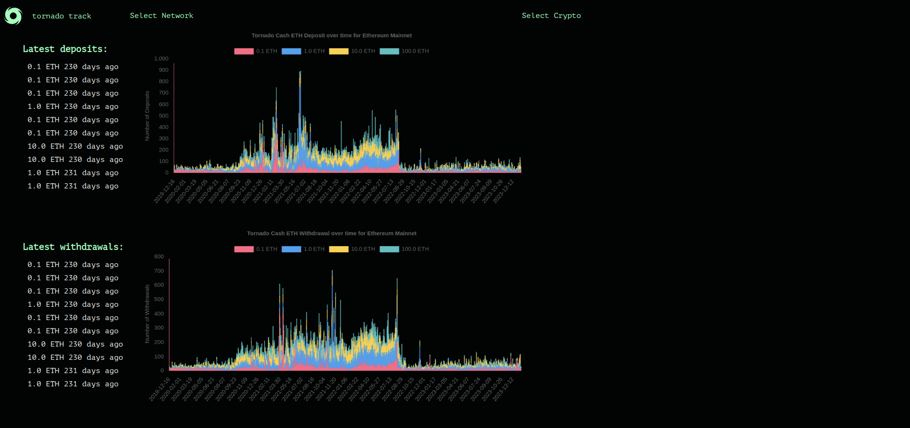

# TornadoTrack




## IDEA:
Create a dashboard for viewing TornadoCash usage over time.

Features:
- [Done] The dashboard will allow you to see usage on different chains.
- The dashboard will show the last x transactions, along with a live update.
- [Done] The dashboard at its core will be a stacked bar chart showing on a x-ly basis, how many deposits of sum y were made to the mixer.
- Dashboard could also show total value locked in mixer as a chart.
- [TBD] Overlay value of ETH/USD?

Tech Stack:
- HyperIndex to get historical data on all chains
- Backend django server for hosting and serving the pages
- Frontend Jinjas
- [TBD] HyperSync to get live data on a side panel and show last x transactions


# How to install:

Not necessary but best to create a venv:
```sh
pyenv virtualenv 3.10.12 tornado-track
touch .python-version
echo "tornado-track" >> .python-version
```


Check that you are using your venv:
```sh
pip -V
```

Install packages:
```sh
pip install -r requirements.txt
```

Run UI:
```sh
sh run_all.sh
```


