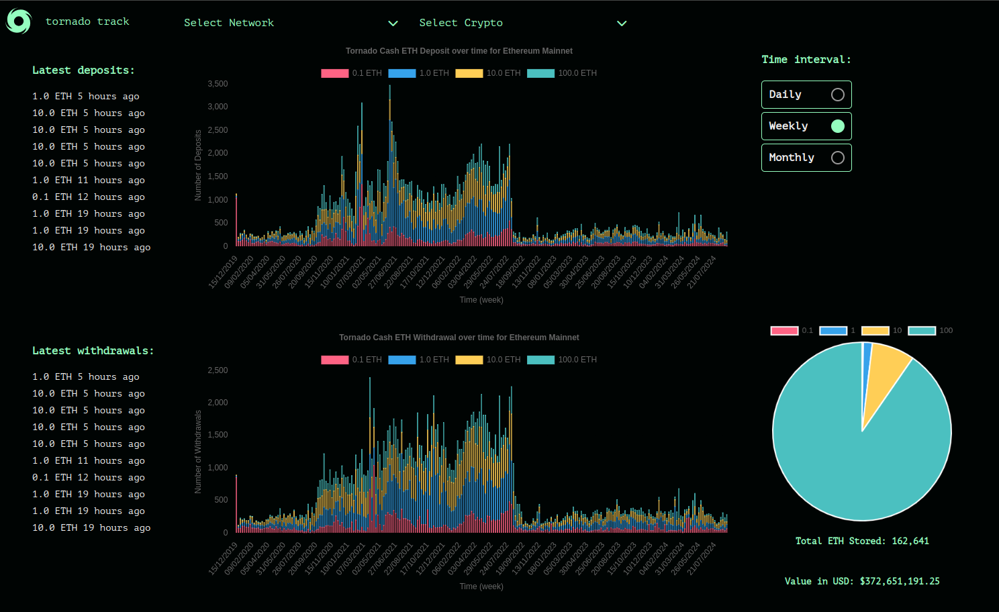
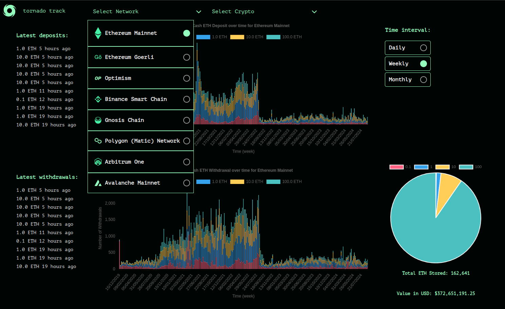
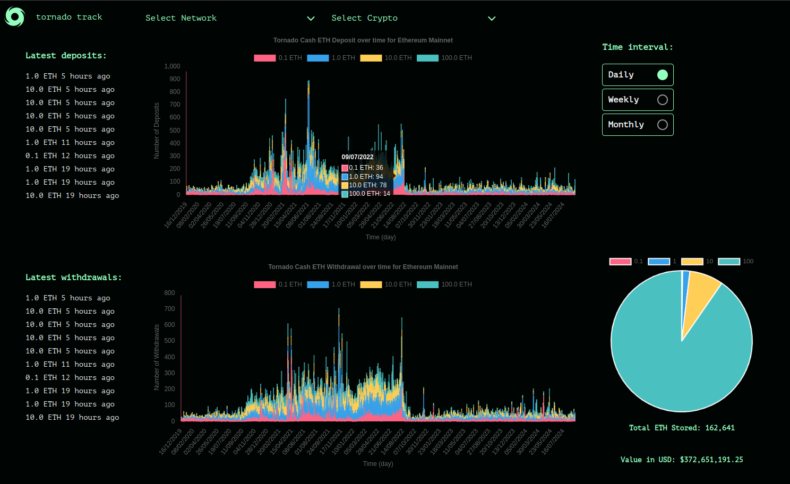
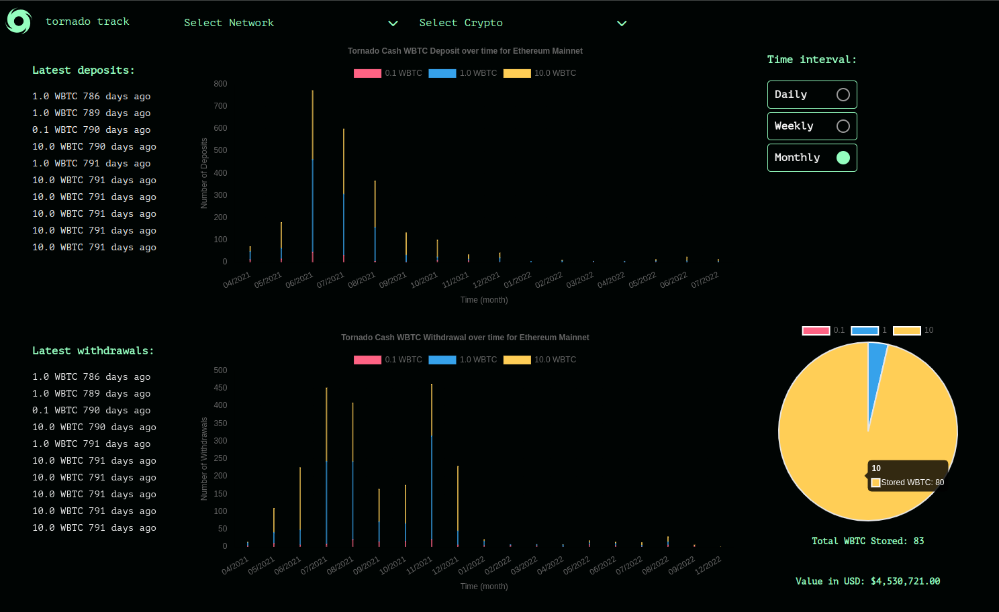

# TornadoTrack




## IDEA
This project focuses on building a dashboard that tracks Tornado Cash transactions over time, offering a clear view of both deposits and withdrawals.

It will highlight transaction trends and patterns, display the latest activities, and show the live balance held in each Tornado Cash contract.

Users will be able to view the data by day, week, or month. The dashboard will also aggregate data from multiple blockchain networks and support all cryptocurrencies, providing an overview of Tornado Cash's usage across the crypto space.
The aim is to create a robust tool for real-time analysis of Tornado Cash activity.


## Tech Stack:

- **Envio HyperIndex:** I am self hosting an Envio HyperIndex instance. This tool is used to retrieve and index historical data across all blockchain networks. It ensures that the dashboard displays an accurate and up to date history of transactions for all relevant cryptocurrencies.

- **Backend:** I am running a Django server to host and serve the web pages. Django was chosen for its robustness and ease of integration with other components of the tech stack (plus I like python:) )
  
- **Frontend:** The frontend is built using Jinjas templating engine, which works very well with Django to render dynamic content on the web pages and vanilla Javascript / CSS - I don't like frameworks much. I am also using the charts.js library to show graphs and the pie chart.


## How to install:

Make sure you have docker and python installed.

Not necessary but best to create a venv:
```sh
pyenv virtualenv 3.10.12 tornado-track
touch .python-version
echo "tornado-track" >> .python-version
```


Check that you are using your venv:
```sh
pip -V
```

Install packages:
```sh
pip install -r requirements.txt
```

Run UI:
```sh
sh run_all.sh
```


# Some more pics:



